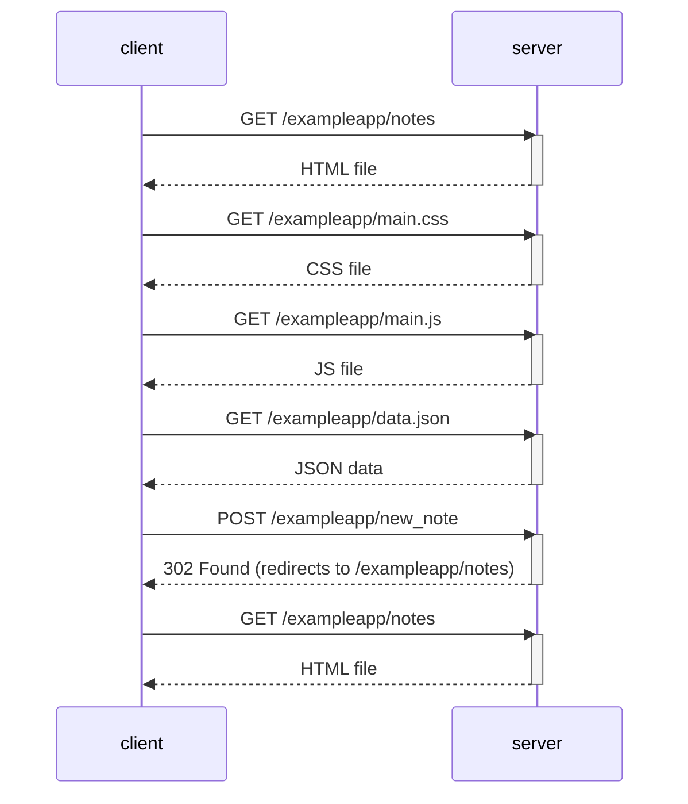

```mermaid
sequenceDiagram
    participant client
    participant server

    client ->> server: GET /exampleapp/notes
    activate server
    server -->> client: HTML file
    deactivate server

    client ->> server: GET /exampleapp/main.css
    activate server
    server -->> client: CSS file
    deactivate server

    client ->> server: GET /exampleapp/main.js
    activate server
    server -->> client: JS file
    deactivate server

    client ->> server: GET /exampleapp/data.json
    activate server
    server -->> client: JSON data
    deactivate server

    client ->> server: POST /exampleapp/new_note
    activate server
    server -->> client: 302 Found (redirects to /exampleapp/notes)
    deactivate server

    client ->> server: GET /exampleapp/notes
    activate server
    server -->> client: HTML file
    deactivate server
```
