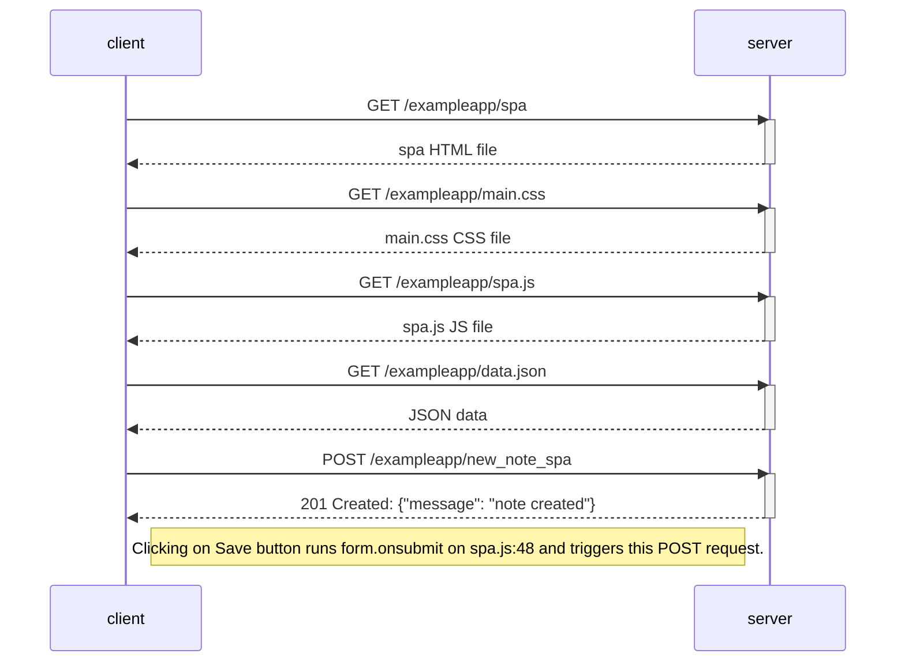

```mermaid
sequenceDiagram
    participant client
    participant server
    
    client ->> server: GET /exampleapp/spa
    activate server
    server -->> client: spa HTML file
    deactivate server
    
    client ->> server: GET /exampleapp/main.css
    activate server
    server -->> client: main.css CSS file
    deactivate server

    client ->> server: GET /exampleapp/spa.js
    activate server
    server -->> client: spa.js JS file
    deactivate server
    
    client ->> server: GET /exampleapp/data.json
    activate server
    server -->> client: JSON data
    deactivate server

    client ->> server: POST /exampleapp/new_note_spa
    activate server
    server -->> client: 201 Created: {"message": "note created"}
    deactivate server
    Note right of client: Clicking on Save button runs form.onsubmit on spa.js:48 and triggers this POST request.
```
